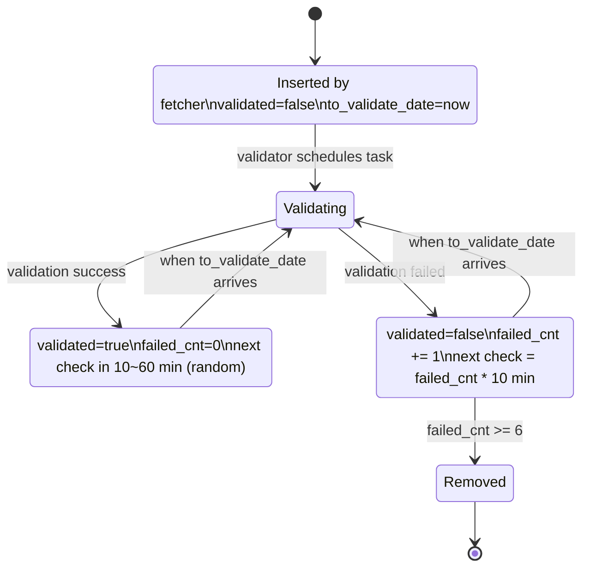
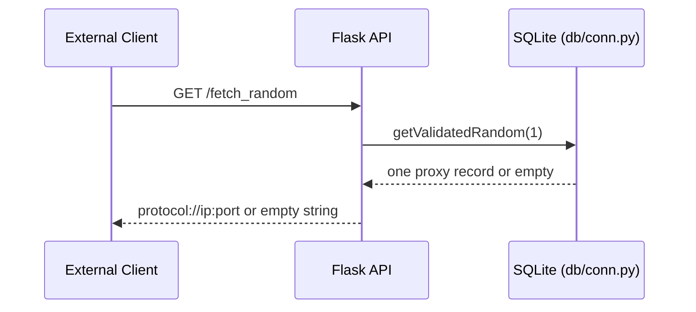

# ProxyPoolWithUI Architecture

## 1) Overall Workflow

```mermaid
flowchart TD
    A[Start: python main.py] --> B[Create proc_lock]
    B --> C[Start fetcher process]
    B --> D[Start validator process]
    B --> E[Start api process]

    A --> M[Supervisor loop in main.py]
    M --> M1{Child process alive?}
    M1 -- No --> M2[Terminate + reset + restart]
    M1 -- Yes --> M3{Run longer than 1 hour?}
    M3 -- Yes --> M4[Proactive restart]
    M3 -- No --> M5[Keep monitoring]

    C --> F1
    D --> V1
    E --> P1

    subgraph F[Fetcher: proc/run_fetcher.py]
      F1[Read pool status: getProxiesStatus] --> F2{pending_proxies_cnt > 2000?}
      F2 -- Yes --> F9[Sleep PROC_FETCHER_SLEEP]
      F2 -- No --> F3[Iterate all registered fetchers]
      F3 --> F4{Fetcher enabled?}
      F4 -- No --> F3
      F4 -- Yes --> F5[Run fetcher.fetch with 30s timeout]
      F5 --> F6[Collect protocol/ip/port]
      F6 --> F7[pushNewFetch into proxies]
      F7 --> F8[pushFetcherResult into fetchers stats]
      F8 --> F9
      F9 --> F1
    end

    subgraph V[Validator: proc/run_validator.py]
      V1[Create VALIDATE_THREAD_NUM worker threads] --> V2[Loop: drain out_que results]
      V2 --> V3[pushValidateResult]
      V3 --> V4{running_proxies >= 2 * thread_num?}
      V4 -- Yes --> V8[Sleep PROC_VALIDATOR_SLEEP]
      V4 -- No --> V5[getToValidate fetch tasks]
      V5 --> V6[Deduplicate and enqueue to in_que]
      V6 --> V7{No task added?}
      V7 -- Yes --> V8
      V7 -- No --> V2
      V8 --> V2

      Vw1[Worker: take proxy from in_que] --> Vw2[validate_once -> request VALIDATE_URL]
      Vw2 --> Vw3{Validation passed?}
      Vw3 -- Yes --> Vw4[Record success + latency]
      Vw3 -- No --> Vw5[Retry until VALIDATE_MAX_FAILS]
      Vw4 --> Vw6[Send result to out_que]
      Vw5 --> Vw6
    end

    subgraph P[API/UI: api/api.py]
      P1[Flask on API_HOST:API_PORT<br/>default 127.0.0.1:5000] --> P2[/fetch_random and /fetch_all]
      P1 --> P3[/fetch_http /fetch_https /fetch_socks4 /fetch_socks5]
      P1 --> P4[/web static UI + management APIs]
      P2 --> P5[Return validated proxies]
      P3 --> P5
      P4 --> P6[Enable/disable fetcher, inspect status]
    end

    subgraph DB[SQLite: data.db]
      D1[Table: proxies]:::db
      D2[Table: fetchers]:::db
    end

    F7 --> D1
    F8 --> D2
    V3 --> D1
    P5 --> D1
    P6 --> D2

    classDef db fill:#eef,stroke:#88a,stroke-width:1px;
```

## 2) Proxy Lifecycle



## 3) API Request Sequence


